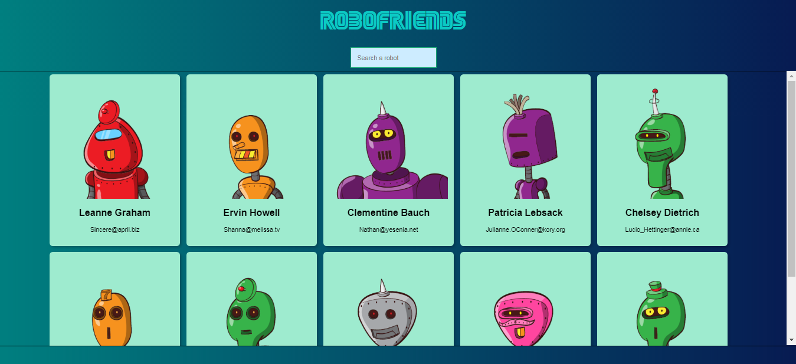

# Robofriend

Robofriend webapp was created to excercise front-end development.

## Highlights:
- HTML, CSS, JavaScript
- React
- AJAX
- Using this APIs:
  - JSON placeholders
  - Robohash

## Screenshots:  
* Screenshot
	  
* Screenshot (Filtered)  
	")  